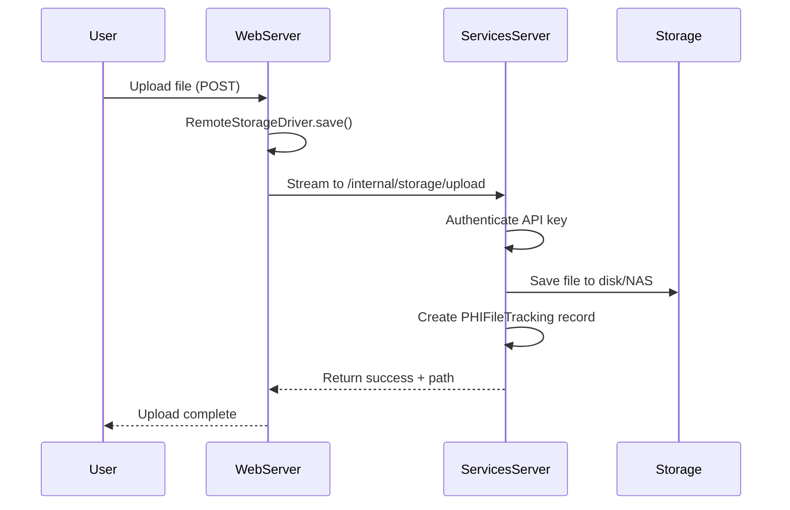
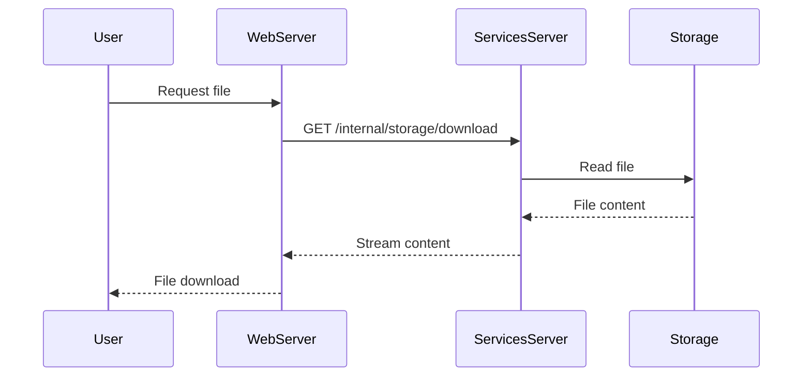

# File Streaming Architecture Documentation

## Overview

NA-ACCORD uses a two-server architecture to securely handle clinical research data files. This design ensures that the web-facing server never stores sensitive files locally, instead streaming all file operations through to a secure services server.

## Architecture Components

### 1. Web Server
- **Role**: Public-facing application server
- **Storage**: NEVER stores files locally
- **Driver**: RemoteStorageDriver
- **Function**: Streams all file operations to services server via HTTP API

### 2. Services Server
- **Role**: Backend services and data storage
- **Storage**: Local filesystem or S3-compatible storage (NAS)
- **Driver**: LocalFileSystemStorage or BaseStorage (S3)
- **Function**: Handles all actual file storage and cleanup operations

## Key Design Principles

1. **No Local Storage on Web Server**: The web server acts as a pure streaming proxy
2. **Application-Controlled Cleanup**: All file cleanup is controlled by application logic, not storage policies
3. **Complete PHI Tracking**: Every file operation is tracked in PHIFileTracking for audit trail
4. **Single-Machine Testing**: The architecture supports testing on a single machine with different ports

## Configuration

### Environment Variables

#### Web Server Configuration
```bash
# Server role identification
SERVER_ROLE=web

# Services server connection
SERVICES_URL=http://services-server:8001
INTERNAL_API_KEY=your-secure-api-key-here

# Storage configuration (automatically uses RemoteStorageDriver)
WORKSPACE_STORAGE_DISK=workspace
```

#### Services Server Configuration
```bash
# Server role identification
SERVER_ROLE=services

# Internal API authentication
INTERNAL_API_KEY=your-secure-api-key-here

# Storage configuration
WORKSPACE_STORAGE_DISK=workspace

# For NAS mount
NAS_WORKSPACE_PATH=/mnt/nas/naaccord

# Storage backend (local or s3)
STORAGE_CONFIG='{
  "disks": {
    "workspace": {
      "driver": "local",
      "root": "/mnt/nas/naaccord/workspace"
    }
  }
}'
```

## File Upload Flow

### 1. User Uploads File to Web Server


### 2. Large File Chunked Upload
For files larger than 10MB, the system uses chunked uploading:

```python
# Web server initiates chunked upload
driver.save_chunked(path, file_obj)
```

This creates a three-phase process:
1. **Init**: Create upload session
2. **Chunk**: Stream file in 64KB chunks
3. **Complete**: Finalize upload and save

## File Retrieval Flow



## Cleanup System

### Automatic Cleanup Flow
1. **Immediate Cleanup**: Business logic deletes files immediately after use
2. **Orphan Detection**: Scheduled job finds files older than threshold
3. **Coordinated Cleanup**: Web server requests cleanup on services server

### Cleanup Coordination
```python
# Web server triggers cleanup on services server
response = session.post(
    '/internal/storage/cleanup',
    json={'hours': 4, 'dry_run': False}
)
```

## Storage Drivers

### RemoteStorageDriver (Web Server)
Located at: `depot/storage/remote.py`

Key features:
- Streams all operations to services server
- Connection pooling for efficiency
- Retry logic for network failures
- Chunked upload support
- No local file storage

### LocalFileSystemStorage (Services Server)
Located at: `depot/storage/local.py`

Key features:
- Direct filesystem operations
- Support for NAS mount points
- Efficient bulk operations (delete_prefix)
- Metadata tracking

## Internal Storage API

The services server exposes these endpoints (authenticated with API key):

| Endpoint | Method | Description |
|----------|--------|-------------|
| `/internal/storage/upload` | POST | Stream file upload |
| `/internal/storage/upload_chunked` | POST | Chunked file upload |
| `/internal/storage/download` | GET | Stream file download |
| `/internal/storage/delete` | POST | Delete single file |
| `/internal/storage/delete_prefix` | POST | Delete all files with prefix |
| `/internal/storage/list` | GET | List files with prefix |
| `/internal/storage/exists` | GET | Check file existence |
| `/internal/storage/metadata` | GET | Get file metadata |
| `/internal/storage/cleanup` | POST | Trigger workspace cleanup |
| `/internal/storage/health` | GET | Health check |

## PHI File Tracking

All file operations create PHIFileTracking records with:

### Standard Fields
- `cohort`: Associated cohort (null for system operations)
- `user`: User who initiated operation
- `action`: Type of operation performed
- `file_path`: Full path to file
- `file_type`: Type of file
- `file_size`: Size in bytes

### Streaming-Specific Fields
- `server_role`: Role of server (web/services/testing)
- `stream_start`: When streaming began
- `stream_complete`: When streaming finished
- `bytes_transferred`: Bytes transferred
- `cleanup_scheduled_for`: When cleanup is scheduled
- `metadata`: Additional tracking data

### Streaming Actions
- `file_uploaded_via_stream`: Regular streaming upload
- `file_uploaded_chunked`: Chunked upload for large files
- `file_downloaded_via_stream`: File retrieval
- `file_deleted_via_api`: Deletion via API
- `prefix_deleted_via_api`: Bulk deletion
- `workspace_cleanup`: Directory cleanup

## Testing

### Single Machine Testing

Run both servers on different ports:

```bash
# Start two-server test environment
python manage.py test_two_server --web-port 8000 --services-port 8001

# With automated tests
python manage.py test_two_server --run-tests
```

### Test Suite

Located at: `depot/tests/test_two_server.py`

Key test cases:
- `TestRemoteStorageDriver`: Tests driver functionality
- `TestStorageManagerServerRoles`: Tests role detection
- `TestEndToEndStreaming`: Tests complete upload flow
- `TestPHITracking`: Tests audit trail creation
- `TestSingleMachineSimulation`: Tests local testing setup

### Manual Testing Verification

1. **Upload a file through web interface**
   - File should appear in services server storage
   - No file should exist on web server
   - PHIFileTracking record created

2. **Check storage locations**
   ```bash
   # On web server - should be empty
   ls -la /tmp/
   
   # On services server - should contain files
   ls -la /mnt/nas/naaccord/workspace/
   ```

3. **Verify cleanup**
   - Wait for cleanup threshold (default 4 hours)
   - Run cleanup job
   - Verify files are removed

## Deployment Checklist

### Pre-Deployment
- [ ] Set `INTERNAL_API_KEY` environment variable on both servers
- [ ] Configure `SERVICES_URL` on web server
- [ ] Mount NAS on services server
- [ ] Set `NAS_WORKSPACE_PATH` on services server
- [ ] Configure `SERVER_ROLE` on both servers

### Deployment Steps
1. Deploy services server first
2. Test internal API endpoints
3. Deploy web server
4. Test end-to-end file upload
5. Verify PHI tracking
6. Schedule cleanup jobs

### Post-Deployment Monitoring
- Monitor disk usage on services server
- Check PHIFileTracking for failed operations
- Verify cleanup job execution
- Monitor internal API response times

## Troubleshooting

### Common Issues

#### 1. "INTERNAL_API_KEY required for web server role"
**Solution**: Set the `INTERNAL_API_KEY` environment variable on web server

#### 2. Files not being cleaned up
**Check**:
- Is cleanup job running? (`python manage.py cleanup_orphaned_files`)
- Are files older than threshold? (default 4 hours)
- Check PHIFileTracking for cleanup attempts

#### 3. Connection refused to services server
**Check**:
- Is services server running?
- Is `SERVICES_URL` correct?
- Firewall rules between servers?

#### 4. Storage full on services server
**Actions**:
- Run immediate cleanup: `python manage.py cleanup_orphaned_files --hours 0`
- Check for stuck uploads in PHIFileTracking
- Verify NAS mount is working

### Debug Commands

```bash
# Check server role
echo $SERVER_ROLE

# Test internal API
curl -H "X-API-Key: $INTERNAL_API_KEY" http://localhost:8001/internal/storage/health

# Check storage configuration
python manage.py shell -c "from depot.storage.manager import StorageManager; print(type(StorageManager.get_workspace_storage()))"

# Manual cleanup trigger
python manage.py shell -c "from depot.storage.workspace_manager_refactored import WorkspaceManager; w = WorkspaceManager(); print(w.cleanup_orphaned_directories(hours=0, dry_run=True))"
```

## Security Considerations

1. **Internal API Key**: Use a strong, unique key for server communication
2. **Network Isolation**: Services server should not be directly accessible from internet
3. **Audit Trail**: All operations tracked in PHIFileTracking
4. **No Web Storage**: Web server cannot store files even if compromised
5. **Cleanup Verification**: Multiple cleanup attempts with tracking

## Performance Optimization

1. **Connection Pooling**: RemoteStorageDriver uses persistent connections
2. **Chunked Uploads**: Large files stream in 64KB chunks
3. **Bulk Operations**: delete_prefix for efficient cleanup
4. **Async Processing**: File operations don't block web requests
5. **Local Caching**: Services server can cache frequently accessed files

## Future Enhancements

1. **Encryption in Transit**: Add TLS between web and services servers
2. **Compression**: Compress files during streaming
3. **Rate Limiting**: Prevent abuse of internal API
4. **Multi-Region**: Support multiple services servers
5. **Backup Integration**: Automatic backup before cleanup