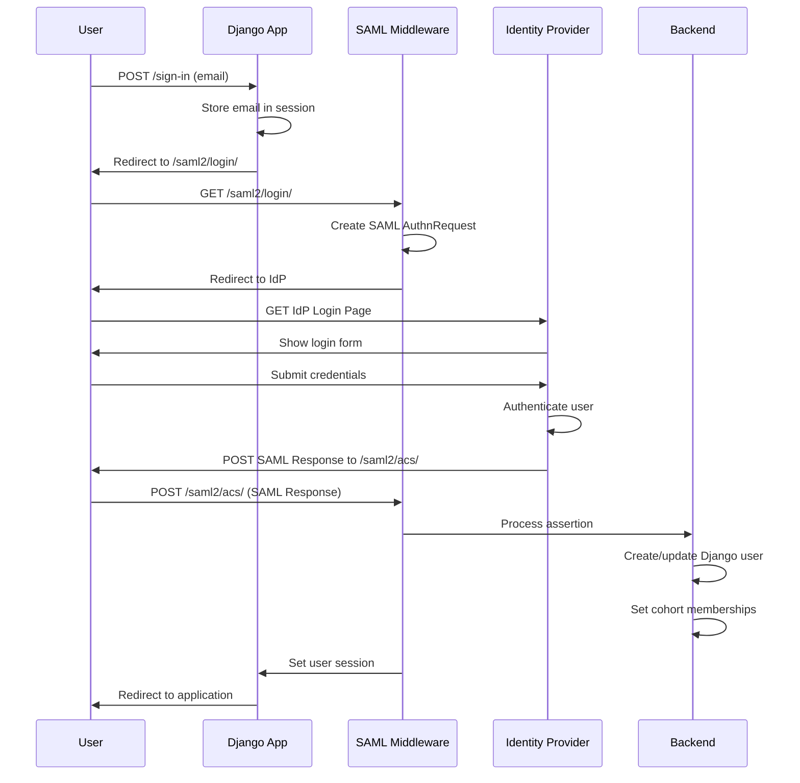

# Authentication Workflow Documentation

## Overview

NA-ACCORD uses SAML 2.0 for authentication, supporting multiple identity providers and environments:

- **Development**: Mock SAML backend (simple username/password)
- **Testing/Staging**: Docker SimpleSAMLphp IdP
- **Production**: Institutional Shibboleth IdPs (Microsoft Azure AD, etc.)

## Authentication Flow

### 1. User Initiation
```
User → /sign-in → Enter institutional email
```

### 2. Institution Detection
The system detects the user's institution from their email domain:

```python
INSTITUTION_DOMAINS = {
    'jhu.edu': 'johns_hopkins',
    'jhmi.edu': 'johns_hopkins',
    'ucsd.edu': 'uc_san_diego',
    'cwru.edu': 'case_western',
    'uab.edu': 'ua_birmingham',
    'uw.edu': 'university_washington',
    'test.edu': 'mock_idp',  # For testing
}
```

### 3. SAML Authentication Flow



### 4. SAML Endpoints

| Endpoint | Purpose | Method |
|----------|---------|--------|
| `/saml2/login/` | Initiate SAML authentication | GET |
| `/saml2/acs/` | Assertion Consumer Service (receive SAML response) | POST |
| `/saml2/ls/` | Logout Service | GET/POST |
| `/saml2/metadata/` | Service Provider metadata | GET |

### 5. User Creation/Update

When a SAML assertion is received, the `SAMLBackend`:

1. **Extracts user attributes** from SAML assertion:
   - email (primary identifier)
   - givenName, sn (first/last name)
   - eduPersonAffiliation (role determination)
   - cohortAccess (cohort memberships)
   - naaccordRole (system role)

2. **Creates or updates Django user**:
   ```python
   user, created = User.objects.get_or_create(
       email=email,
       defaults={
           'username': generated_username,
           'first_name': first_name,
           'last_name': last_name,
       }
   )
   ```

3. **Updates cohort memberships** based on `cohortAccess` attribute

4. **Sets user permissions** based on role

## Configuration

### Environment Variables

```bash
# .env file
USE_DOCKER_SAML=true    # Use Docker SimpleSAMLphp IdP
USE_MOCK_SAML=false     # Use mock backend (development only)

# SAML Configuration
SAML_ENTITY_ID=http://localhost:8000
SAML_ACS_URL=http://localhost:8000/saml2/acs/
SAML_SLS_URL=http://localhost:8000/saml2/ls/
SAML_IDP_METADATA_URL=http://localhost:8080/simplesaml/saml2/idp/metadata.php
```

### Django Settings

```python
# depot/settings.py

# Authentication backends
if USE_DOCKER_SAML:
    AUTHENTICATION_BACKENDS = [
        "depot.auth.saml_backend.SAMLBackend",
        "django.contrib.auth.backends.ModelBackend",  # Fallback
    ]

# SAML Configuration
SAML_CONFIG = {
    'entityid': 'http://localhost:8000',
    'metadata': {
        'remote': [{
            'url': 'http://localhost:8080/simplesaml/saml2/idp/metadata.php',
        }],
    },
    'service': {
        'sp': {
            'endpoints': {
                'assertion_consumer_service': [
                    ('http://localhost:8000/saml2/acs/', BINDING_HTTP_POST),
                ],
                'single_logout_service': [
                    ('http://localhost:8000/saml2/ls/', BINDING_HTTP_REDIRECT),
                ],
            },
        },
    },
}

# SAML Settings
SAML_CREATE_UNKNOWN_USER = True
SAML_IGNORE_AUTHENTICATED_USERS_ON_LOGIN = True
```

### Middleware Configuration

The authentication flow requires these middleware components in order:

```python
MIDDLEWARE = [
    'django.contrib.sessions.middleware.SessionMiddleware',
    'django.contrib.auth.middleware.AuthenticationMiddleware',
    'djangosaml2.middleware.SamlSessionMiddleware',  # After AuthenticationMiddleware
    'depot.middleware.signed_in.SignedInMiddleware',
]
```

**Important**: The `SignedInMiddleware` must exclude SAML paths:

```python
# depot/middleware/signed_in.py
self.excluded_paths = [
    re.compile(r"^/saml2/"),  # Allow SAML authentication flow
    re.compile(r"^/sign-in$"),
    # ... other excluded paths
]
```

## Attribute Mapping

SAML attributes are mapped to Django user properties:

| SAML Attribute | Django User Field | Purpose |
|----------------|-------------------|---------|
| email | email | Primary identifier |
| givenName | first_name | User's first name |
| sn | last_name | User's surname |
| eduPersonAffiliation | (determines is_staff) | Role determination |
| cohortAccess | CohortMembership | Cohort access control |
| naaccordRole | (custom processing) | System role (admin/researcher/etc) |
| organization | (stored in profile) | Institution name |

## Security Considerations

### SAML Security
- **Signature Verification**: All SAML assertions are cryptographically signed
- **Certificate Management**: SP certificates in `saml_certs/` directory
- **Replay Protection**: SAML assertions include timestamps and are single-use
- **Entity ID Matching**: Strict validation of IdP entity IDs

### Session Security
- **Session Timeout**: Configurable via `SAML_SESSION_TIMEOUT` (default: 3600 seconds)
- **CSRF Protection**: Django CSRF middleware protects all POST endpoints
- **Secure Cookies**: Session cookies use HttpOnly and Secure flags in production

### Access Control
- **Cohort-based**: Users only access data for their assigned cohorts
- **Role-based**: Different roles (admin, researcher, viewer) have different permissions
- **Attribute-based**: SAML attributes determine initial access rights

## Troubleshooting

### Common Issues

#### 1. Redirect Loop to /sign-in
**Cause**: `SignedInMiddleware` blocking SAML paths  
**Solution**: Add `/saml2/` to excluded paths in middleware

#### 2. "No attribute converters" Error
**Cause**: `attribute_map_dir` configuration issue  
**Solution**: Remove or fix the attribute_map_dir setting

#### 3. Empty IDP List
**Cause**: Metadata not loading properly  
**Solution**: Use 'remote' instead of 'local' for metadata URLs

#### 4. 500 Error on /saml2/login/
**Cause**: Missing SamlSessionMiddleware  
**Solution**: Add middleware after AuthenticationMiddleware

### Debug Commands

```bash
# Test SAML configuration
python manage.py shell -c "
from djangosaml2.conf import get_config
from djangosaml2.utils import available_idps
conf = get_config()
print('Available IDPs:', available_idps(conf))
"

# Test metadata fetch
curl http://localhost:8080/simplesaml/saml2/idp/metadata.php

# Test SAML login redirect
curl -I http://localhost:8000/saml2/login/
```

## Testing Different Authentication Modes

### Mock SAML (Simple Development)
```bash
USE_MOCK_SAML=true
USE_DOCKER_SAML=false
# Uses depot.auth.mock_backend.MockSAMLBackend
```

### Docker SAML (Testing/Staging)
```bash
USE_DOCKER_SAML=true
USE_MOCK_SAML=false
# Uses depot.auth.saml_backend.SAMLBackend with Docker IdP
```

### Production SAML (Live Environment)
```bash
DEBUG=false
# Automatically uses depot.auth.saml_backend.SAMLBackend
# Points to institutional Shibboleth IdP
```