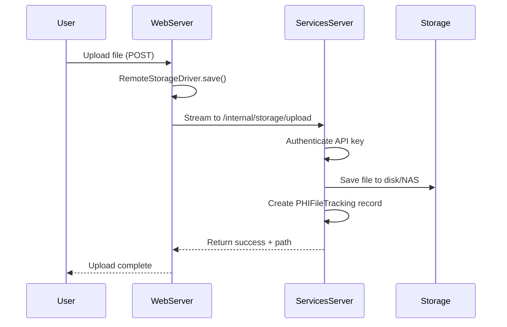
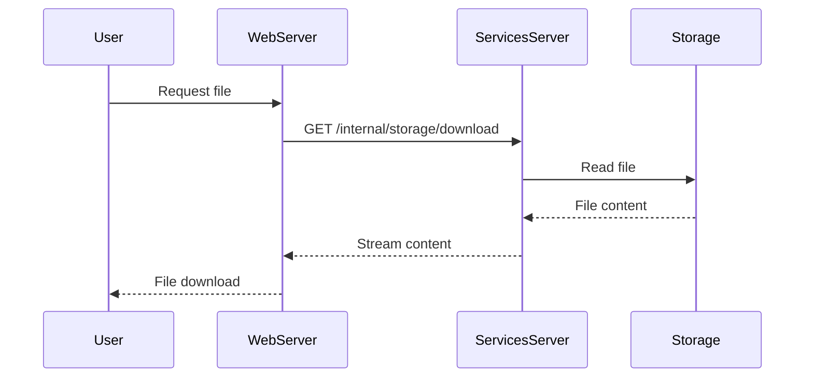

# File Streaming Architecture

**Complete guide to NA-ACCORD's two-server file streaming system for PHI-compliant data handling**

**Last Updated:** 2025-10-15

---

## Table of Contents
1. [Overview](#overview)
2. [Architecture](#architecture)
3. [Quick Start](#quick-start)
4. [Configuration](#configuration)
5. [Development Setup](#development-setup)
6. [File Upload Flow](#file-upload-flow)
7. [Storage Drivers](#storage-drivers)
8. [Internal Storage API](#internal-storage-api)
9. [PHI File Tracking](#phi-file-tracking)
10. [Testing](#testing)
11. [Production Deployment](#production-deployment)
12. [Troubleshooting](#troubleshooting)

---

## Overview

NA-ACCORD uses a two-server architecture to securely handle clinical research data files. This design ensures that the web-facing server never stores sensitive files locally, instead streaming all file operations through to a secure services server.

### Key Design Principles

1. **No Local Storage on Web Server**: The web server acts as a pure streaming proxy
2. **Application-Controlled Cleanup**: All file cleanup is controlled by application logic, not storage policies
3. **Complete PHI Tracking**: Every file operation is tracked in PHIFileTracking for audit trail
4. **Single-Machine Testing**: The architecture supports testing on a single machine with different ports

---

## Architecture

### Production Architecture
```
Internet → Web Server (Port 80/443) → Services Server (Internal)
           (No file storage)          (File storage + processing)
```

### Development Architecture
```
Browser → Web Server (Port 8000) → Services Server (Port 8001)
          (No file storage)         (File storage + processing)
```

### Architecture Components

#### 1. Web Server
- **Role**: Public-facing application server
- **Storage**: NEVER stores files locally
- **Driver**: RemoteStorageDriver
- **Function**: Streams all file operations to services server via HTTP API

#### 2. Services Server
- **Role**: Backend services and data storage
- **Storage**: NAS network storage (driver architecture supports future S3-compatible migration)
- **Driver**: LocalFileSystemStorage (NAS mount)
- **Function**: Handles all actual file storage and cleanup operations

### Storage Manager (`depot/storage/manager.py`)

The `StorageManager` class provides intelligent routing based on server role:

- `get_workspace_storage()`: Automatically detects `SERVER_ROLE` and routes accordingly
  - When `SERVER_ROLE=web`: Returns `RemoteStorageDriver` (streams to services)
  - When `SERVER_ROLE=services`: Returns `LocalFileSystemStorage` (stores on NAS)
  - When `SERVER_ROLE=testing`: Returns `LocalFileSystemStorage` (local testing)

---

## Quick Start

### Prerequisites

- Fresh database (migrations applied)
- Python virtual environment activated
- All dependencies installed

### 1. Create Default Superuser

```bash
# Create the default superuser
python manage.py create_default_superuser
```

**Login Credentials:**
- Email: `ewestlund@jhu.edu`
- Password: `admin123`
- Role: Superuser + NAAccord Administrator

### 2. Start Development with Streaming (Recommended)

**Option A: Use Tmux Script**
```bash
# Start Docker services
docker compose -f docker-compose.dev.yml up -d

# Start tmux session with streaming
tmux attach -t na  # or start new session
```

This creates:
- Web server on port 8000 (`SERVER_ROLE=web`)
- Services server on port 8001 (`SERVER_ROLE=services`)
- All other development tools (Celery, NPM, R, etc.)

**Option B: Manual Two-Server Setup**

```bash
# Start both servers on different ports with test runner
python manage.py test_two_server --web-port 8000 --services-port 8001 --run-tests

# Or start manually for interactive testing
python manage.py test_two_server --web-port 8000 --services-port 8001
```

This will:
- Start services server on port 8001 (handles actual file storage)
- Start web server on port 8000 (streams files to services server)
- Run the test suite automatically if `--run-tests` is used

### 3. Verify Setup

#### Access Web Interface
1. Open browser to `http://localhost:8000`
2. Login with `ewestlund@jhu.edu` / `admin123`
3. Upload a file through the interface

#### Verify Streaming
1. **Web Server** (port 8000): Should have NO files stored locally
2. **Services Server** (port 8001): Should contain all uploaded files
3. **PHI Tracking**: Check database for streaming operation records

```bash
# Check files on web server (should be empty)
ls -la /tmp/

# Check files on services server (should contain files)
ls -la storage/workspace/

# Check PHI tracking in Django shell
python manage.py shell
>>> from depot.models import PHIFileTracking
>>> PHIFileTracking.objects.filter(action__contains='stream').count()
```

---

## Configuration

### Environment Variables

#### Web Server Configuration
```bash
# Server role identification
SERVER_ROLE=web

# Services server connection
SERVICES_URL=http://services-server:8001
INTERNAL_API_KEY=your-secure-api-key-here

# Storage configuration (automatically uses RemoteStorageDriver)
WORKSPACE_STORAGE_DISK=workspace
```

#### Services Server Configuration
```bash
# Server role identification
SERVER_ROLE=services

# Internal API authentication
INTERNAL_API_KEY=your-secure-api-key-here

# Storage configuration
WORKSPACE_STORAGE_DISK=workspace

# For NAS mount
NAS_WORKSPACE_PATH=/mnt/nas/naaccord

# Storage backend (NAS via local driver)
# Note: Driver architecture supports future S3-compatible migration
STORAGE_CONFIG='{
  "disks": {
    "workspace": {
      "driver": "local",
      "root": "/mnt/nas/naaccord/workspace"
    }
  }
}'
```

### Django Settings

The storage configuration in `settings.py`:

```python
STORAGE_CONFIG = {
    'disks': {
        'local': {
            'driver': 'local',
            'root': str(BASE_DIR / 'storage' / 'nas'),
        },
        'workspace': {
            'driver': 'local',  # Services server uses local
            'root': str(BASE_DIR / 'storage' / 'workspace'),
        }
    }
}

# Note: Web server dynamically overrides workspace config
# when SERVER_ROLE=web to use RemoteStorageDriver
```

### Storage Configuration Options

#### Services Server (with NAS)
```python
# In settings.py or environment
STORAGE_CONFIG = {
    'disks': {
        'workspace': {
            'driver': 'local',
            'root': '/mnt/nas/naaccord/workspace'
        }
    }
}
```

#### Future: S3-Compatible Storage (Not Currently Used)
```python
# Driver architecture supports future S3-compatible migration if needed
# Example configuration (not currently in use):
STORAGE_CONFIG = {
    'disks': {
        'workspace': {
            'driver': 's3',
            'bucket': 'naaccord-workspace',
            'endpoint': 'https://s3.amazonaws.com',
            'access_key': 'YOUR_ACCESS_KEY',
            'secret_key': 'YOUR_SECRET_KEY'
        }
    }
}
```

---

## Development Setup

### Starting Development Servers

#### Option 1: Using tmux (Development)

```bash
# Start tmux session
tmux new-session -s naaccord

# Tab 1: Services server
export SERVER_ROLE=services
export INTERNAL_API_KEY=test-key-123
python manage.py runserver 127.0.0.1:8001

# Tab 2: Web server
export SERVER_ROLE=web
export INTERNAL_API_KEY=test-key-123
export SERVICES_URL=http://localhost:8001
python manage.py runserver 127.0.0.1:8000
```

#### Option 2: Using Management Command

```bash
# Starts both servers automatically
python manage.py test_two_server \
  --web-port 8000 \
  --services-port 8001 \
  --api-key test-key-123
```

### Development Benefits

#### ✅ Advantages

- **Production Simulation**: Exact same behavior as production
- **Security Testing**: Web server never touches files
- **Stream Testing**: Can test large file uploads without local storage
- **PHI Compliance**: Proper tracking of which server handles what
- **Debugging**: Separate logs for web vs file operations

#### 🔧 Development Features

- **Single Machine**: Both servers run on localhost
- **Easy Debugging**: Each server in separate tmux window
- **Hot Reload**: Both servers support code changes
- **Shared Database**: Both servers use same MariaDB instance
- **Easy Reset**: `tmux kill-session -t na` stops everything

---

## File Upload Flow

### 1. User Uploads File to Web Server



### 2. Large File Chunked Upload

For files larger than 10MB, the system uses chunked uploading:

```python
# Web server initiates chunked upload
driver.save_chunked(path, file_obj)
```

This creates a three-phase process:
1. **Init**: Create upload session
2. **Chunk**: Stream file in 64KB chunks
3. **Complete**: Finalize upload and save

### 3. File Retrieval Flow



### Upload Flow Details

1. **User uploads file** through web interface
2. **Web server** receives file in memory
3. **StorageManager.get_workspace_storage()** returns `RemoteStorageDriver`
4. **RemoteStorageDriver** streams file to services server
5. **Services server** receives stream at `/internal/storage/upload`
6. **Services server** saves to NAS using `LocalFileSystemStorage`
7. **Response** returned through chain to user

---

## Storage Drivers

### RemoteStorageDriver (Web Server)

Located at: `depot/storage/remote.py`

Key features:
- Streams all operations to services server
- Connection pooling for efficiency
- Retry logic for network failures
- Chunked upload support
- No local file storage

### LocalFileSystemStorage (Services Server)

Located at: `depot/storage/local.py`

Key features:
- Direct filesystem operations
- Support for NAS mount points
- Efficient bulk operations (delete_prefix)
- Metadata tracking

### Code Implementation

#### Correct Usage (Supports Streaming)

```python
from depot.storage.manager import StorageManager

# CORRECT: Uses workspace storage with automatic routing
storage = StorageManager.get_workspace_storage()
saved_path = storage.save(
    path='upload_prechecks/cohort_1/patient/data.csv',
    content=file_content,
    content_type='text/csv'
)
```

#### Incorrect Usage (Bypasses Streaming)

```python
# WRONG: Bypasses server role detection
storage = StorageManager.get_submission_storage()  # Don't use this

# WRONG: Direct instantiation
storage = LocalFileSystemStorage('local')  # Never do this
```

---

## Internal Storage API

The services server exposes these endpoints (authenticated with API key):

| Endpoint | Method | Description |
|----------|--------|-------------|
| `/internal/storage/upload` | POST | Stream file upload |
| `/internal/storage/upload_chunked` | POST | Chunked file upload |
| `/internal/storage/download` | GET | Stream file download |
| `/internal/storage/delete` | POST | Delete single file |
| `/internal/storage/delete_prefix` | POST | Delete all files with prefix |
| `/internal/storage/list` | GET | List files with prefix |
| `/internal/storage/exists` | GET | Check file existence |
| `/internal/storage/metadata` | GET | Get file metadata |
| `/internal/storage/cleanup` | POST | Trigger workspace cleanup |
| `/internal/storage/health` | GET | Health check |

### Internal API Communication

The web server communicates with services server via REST API:

```bash
# Example internal API calls from web to services
POST localhost:8001/internal/storage/upload     # Stream file upload
GET  localhost:8001/internal/storage/download   # Retrieve file
DELETE localhost:8001/internal/storage/delete   # Delete file
POST localhost:8001/internal/storage/cleanup    # Cleanup operations
```

Authentication uses `INTERNAL_API_KEY` header.

### Middleware Configuration

The `SignedInMiddleware` must exclude `/internal/` paths to allow API key authentication:

```python
# depot/middleware/signed_in.py
self.excluded_paths = [
    # ... other paths ...
    re.compile(r"^/internal/"),  # Required for services communication
]
```

Without this exclusion, internal API endpoints will redirect to login instead of accepting API key authentication.

---

## PHI File Tracking

All file operations create PHIFileTracking records with:

### Standard Fields
- `cohort`: Associated cohort (null for system operations)
- `user`: User who initiated operation
- `action`: Type of operation performed
- `file_path`: Full path to file
- `file_type`: Type of file
- `file_size`: Size in bytes

### Streaming-Specific Fields
- `server_role`: Role of server (web/services/testing)
- `stream_start`: When streaming began
- `stream_complete`: When streaming finished
- `bytes_transferred`: Bytes transferred
- `cleanup_scheduled_for`: When cleanup is scheduled
- `metadata`: Additional tracking data

### Streaming Actions
- `file_uploaded_via_stream`: Regular streaming upload
- `file_uploaded_chunked`: Chunked upload for large files
- `file_downloaded_via_stream`: File retrieval
- `file_deleted_via_api`: Deletion via API
- `prefix_deleted_via_api`: Bulk deletion
- `workspace_cleanup`: Directory cleanup

---

## Testing

### Unit Tests
```bash
# Run all streaming tests
python manage.py test depot.tests.test_streaming_simple -v 2

# Run original two-server tests
python manage.py test depot.tests.test_two_server.TestStorageManagerServerRoles -v 2
python manage.py test depot.tests.test_two_server.TestRemoteStorageDriver -v 2
```

### Integration Testing
```bash
# Start servers with test command
python manage.py test_two_server --run-tests
```

### Test Suite

Located at: `depot/tests/test_two_server.py`

Key test cases:
- `TestRemoteStorageDriver`: Tests driver functionality
- `TestStorageManagerServerRoles`: Tests role detection
- `TestEndToEndStreaming`: Tests complete upload flow
- `TestPHITracking`: Tests audit trail creation
- `TestSingleMachineSimulation`: Tests local testing setup

### Manual Testing

#### 1. File Upload Test
1. Upload file via web interface
2. Check that web server has no local files
3. Verify file exists on services server
4. Confirm PHI tracking record created

#### 2. Large File Test
1. Upload file >10MB (triggers chunked upload)
2. Verify successful transfer
3. Check PHI tracking shows chunked upload action

#### 3. Cleanup Test
1. Upload files to different upload prechecks
2. Wait or modify timestamps to make files "old"
3. Run cleanup: `python manage.py cleanup_orphaned_files --hours 0`
4. Verify old files removed, recent files preserved

### Manual Testing Verification

1. **Upload a file through web interface**
   - File should appear in services server storage
   - No file should exist on web server
   - PHIFileTracking record created

2. **Check storage locations**
   ```bash
   # On web server - should be empty
   ls -la /tmp/

   # On services server - should contain files
   ls -la /mnt/nas/naaccord/workspace/
   ```

3. **Verify cleanup**
   - Wait for cleanup threshold (default 4 hours)
   - Run cleanup job
   - Verify files are removed

---

## Production Deployment

### Environment Variables

#### Web Server (port 80/443)
```bash
export SERVER_ROLE=web
export SERVICES_URL=http://services-server:8001
export INTERNAL_API_KEY=your-secure-api-key-here
```

#### Services Server (internal network)
```bash
export SERVER_ROLE=services
export INTERNAL_API_KEY=your-secure-api-key-here
export NAS_WORKSPACE_PATH=/mnt/nas/naaccord
export WORKSPACE_STORAGE_DISK=workspace
```

### Deployment Steps

1. **Deploy Services Server First**
   ```bash
   # Set environment variables
   export SERVER_ROLE=services
   export INTERNAL_API_KEY=production-key

   # Start services server
   python manage.py runserver 0.0.0.0:8001
   ```

2. **Test Internal API**
   ```bash
   curl -H "X-API-Key: production-key" \
        http://services-server:8001/internal/storage/health
   ```

3. **Deploy Web Server**
   ```bash
   # Set environment variables
   export SERVER_ROLE=web
   export SERVICES_URL=http://services-server:8001
   export INTERNAL_API_KEY=production-key

   # Start web server
   python manage.py runserver 0.0.0.0:8000
   ```

4. **Test End-to-End**
   - Upload file through web interface
   - Verify no local storage on web server
   - Verify file exists on services server
   - Check PHI tracking records

### Deployment Checklist

#### Pre-Deployment
- [ ] Set `INTERNAL_API_KEY` environment variable on both servers
- [ ] Configure `SERVICES_URL` on web server
- [ ] Mount NAS on services server
- [ ] Set `NAS_WORKSPACE_PATH` on services server
- [ ] Configure `SERVER_ROLE` on both servers

#### Deployment Steps
1. Deploy services server first
2. Test internal API endpoints
3. Deploy web server
4. Test end-to-end file upload
5. Verify PHI tracking
6. Schedule cleanup jobs

#### Post-Deployment Monitoring
- Monitor disk usage on services server
- Check PHIFileTracking for failed operations
- Verify cleanup job execution
- Monitor internal API response times

### Key Differences: Development vs Production

| Aspect | Development | Production |
|--------|-------------|------------|
| **Servers** | Same machine, different ports | Different machines |
| **Networking** | localhost:8001 | Internal network/VPN |
| **Storage** | Local filesystem | NAS mount or S3 |
| **SSL** | HTTP | HTTPS with certificates |
| **API Key** | `test-key-123` | Secure generated key |

---

## Troubleshooting

### Common Issues

#### Issue: "INTERNAL_API_KEY required for web server role"
**Cause**: Missing API key environment variable
**Solution**: Set the `INTERNAL_API_KEY` environment variable on web server

```bash
export INTERNAL_API_KEY=your-secure-key
```

#### Issue: Files not being cleaned up
**Check**:
- Is cleanup job running? (`python manage.py cleanup_orphaned_files`)
- Are files older than threshold? (default 4 hours)
- Check PHIFileTracking for cleanup attempts

**Actions**:
```bash
# Run immediate cleanup
python manage.py cleanup_orphaned_files --hours 0

# Check for stuck uploads in PHIFileTracking
python manage.py shell -c "from depot.models import PHIFileTracking; print(PHIFileTracking.objects.filter(cleanup_required=True, cleaned_up=False).count())"
```

#### Issue: Connection refused to services server
**Check**:
- Is services server running?
- Is `SERVICES_URL` correct?
- Firewall rules between servers?

**Solution**:
```bash
# Verify services server is running
curl http://localhost:8001/

# Check SERVICES_URL
echo $SERVICES_URL  # Should be http://localhost:8001
```

#### Issue: Storage full on services server
**Actions**:
- Run immediate cleanup: `python manage.py cleanup_orphaned_files --hours 0`
- Check for stuck uploads in PHIFileTracking
- Verify NAS mount is working

#### Issue: Files Saving Locally on Web Server

**Symptom**: Files appear in `/storage/nas/` on web server

**Cause**: Code is using `get_submission_storage()` instead of `get_workspace_storage()`

**Fix**: Update code to use:
```python
storage = StorageManager.get_workspace_storage()
```

#### Issue: No Streaming Activity in Logs

**Symptom**: No API requests appear in services server logs

**Causes**:
1. `SERVER_ROLE` environment variable not set
2. Using wrong storage method
3. Services server not running

**Verification**:
```bash
# Check environment
echo $SERVER_ROLE  # Should output "web" on web server

# Test services server
curl -H "X-API-Key: test-key-123" \
  http://localhost:8001/internal/storage/health
```

#### Issue: Authentication Errors

**Symptom**: 403 Forbidden or 401 Unauthorized

**Cause**: `INTERNAL_API_KEY` mismatch between servers

**Fix**: Ensure same API key on both servers:
```bash
# Both servers need same key
export INTERNAL_API_KEY=<same-secure-key>
```

#### Issue: Port Already in Use
```bash
# Kill existing processes
lsof -ti :8000 | xargs kill -9
lsof -ti :8001 | xargs kill -9
```

#### Issue: File Not Found Errors
- Web server can't see files in `storage/workspace/`
- Must use services server API to access files
- Check logs for file paths

### Debug Commands

```bash
# Check server role
echo $SERVER_ROLE

# Test internal API
curl -H "X-API-Key: $INTERNAL_API_KEY" http://localhost:8001/internal/storage/health

# Check storage configuration
python manage.py shell -c "from depot.storage.manager import StorageManager; print(type(StorageManager.get_workspace_storage()))"

# Test storage configuration
python manage.py shell -c "
from depot.storage.manager import StorageManager
storage = StorageManager.get_workspace_storage()
print(f'Storage type: {type(storage).__name__}')
if hasattr(storage, 'service_url'):
    print(f'Service URL: {storage.service_url}')
"

# Manual cleanup trigger
python manage.py shell -c "from depot.storage.workspace_manager_refactored import WorkspaceManager; w = WorkspaceManager(); print(w.cleanup_orphaned_directories(hours=0, dry_run=True))"
```

### Health Checks

```bash
# Services server health
curl -H "X-API-Key: $INTERNAL_API_KEY" \
     http://services-server:8001/internal/storage/health

# Storage operations test
python manage.py shell -c "
from depot.storage.manager import StorageManager
from depot.storage.workspace_manager_refactored import WorkspaceManager

# Test storage
storage = StorageManager.get_workspace_storage()
print(f'Storage: {type(storage).__name__}')

# Test workspace manager
workspace = WorkspaceManager()
usage = workspace.get_workspace_usage()
print(f'Workspace usage: {usage}')
"
```

---

## Security Considerations

1. **Internal API Key**: Use a strong, unique key for server communication
2. **Network Isolation**: Services server should not be directly accessible from internet
3. **Audit Trail**: All operations tracked in PHIFileTracking
4. **No Web Storage**: Web server cannot store files even if compromised
5. **Cleanup Verification**: Multiple cleanup attempts with tracking
6. **API Key Security**: Use strong, randomly generated API keys in production
7. **TLS/SSL**: Use HTTPS for production communication between servers
8. **Firewall Rules**: Restrict services server to only accept connections from web servers
9. **No PHI on Web Server**: Regularly audit to ensure no PHI files on web tier

---

## Performance Optimization

1. **Connection Pooling**: RemoteStorageDriver uses persistent connections
2. **Chunked Uploads**: Large files stream in 64KB chunks
3. **Bulk Operations**: delete_prefix for efficient cleanup
4. **Async Processing**: File operations don't block web requests
5. **Local Caching**: Services server can cache frequently accessed files

---

## Migration from Single Server

If migrating from single-server to two-server architecture:

1. **Update all storage calls**:
   - Find: `StorageManager.get_submission_storage()`
   - Replace with: `StorageManager.get_workspace_storage()`

2. **Search for direct storage instantiation**:
   ```bash
   grep -r "LocalFileSystemStorage\|BaseStorage" --include="*.py"
   # Replace with StorageManager calls
   ```

3. **Set environment variables** before starting servers

4. **Test thoroughly** before production deployment

---

## Related Documentation

- **[WireGuard VPN](../security/wireguard.md)** - Encrypted tunnel for PHI data
- **[Storage Manager Abstraction](storage-manager-abstraction.md)** - Multi-driver storage system
- **[PHI File Tracking](../security/PHIFileTracking-system.md)** - Complete audit trail
- **[Architecture Overview](../deployment/guides/architecture.md)** - Two-server design
- **[Deployment Steps](../../deploy/deploy-steps.md)** - Production deployment guide

---

## Quick Reference

### Start Development
```bash
docker compose -f docker-compose.dev.yml up -d  # Start Docker services
tmux attach -t na                               # Start tmux session with streaming
```

### Access Points
- **Web Interface**: http://localhost:8000
- **Services API**: http://localhost:8001 (internal only)
- **Flower**: http://localhost:5555
- **MinIO**: http://localhost:9000

### Stop Development
```bash
tmux kill-session -t na                        # Stop all tmux windows
docker compose -f docker-compose.dev.yml down  # Stop Docker services
```

### Test Streaming
```bash
python manage.py test depot.tests.test_streaming_simple
```

---

**Architecture Summary:**

✅ **Web Server**: Never stores files, streams to services
✅ **Services Server**: Handles all file storage (NAS/S3)
✅ **PHI Tracking**: Complete audit trail of all operations
✅ **Security**: Internal API key authentication
✅ **Testing**: Single-machine simulation for development
✅ **Cleanup**: Application-controlled file lifecycle

The system is now ready for production use with complete file streaming between servers!
